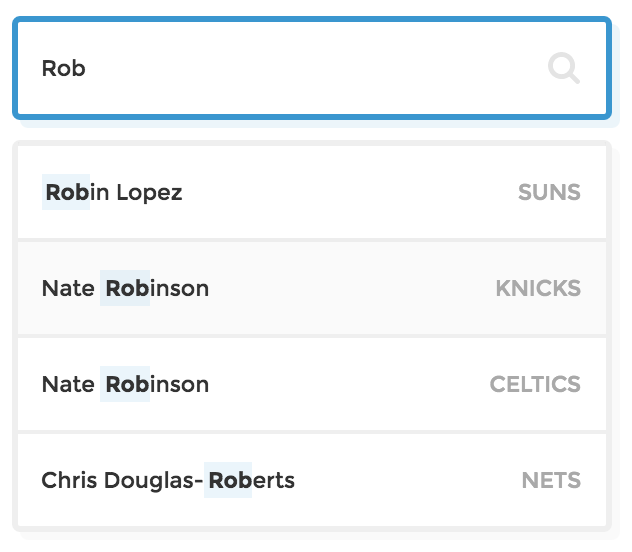
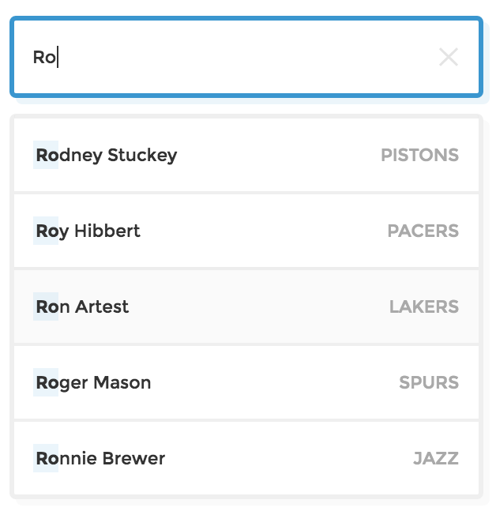
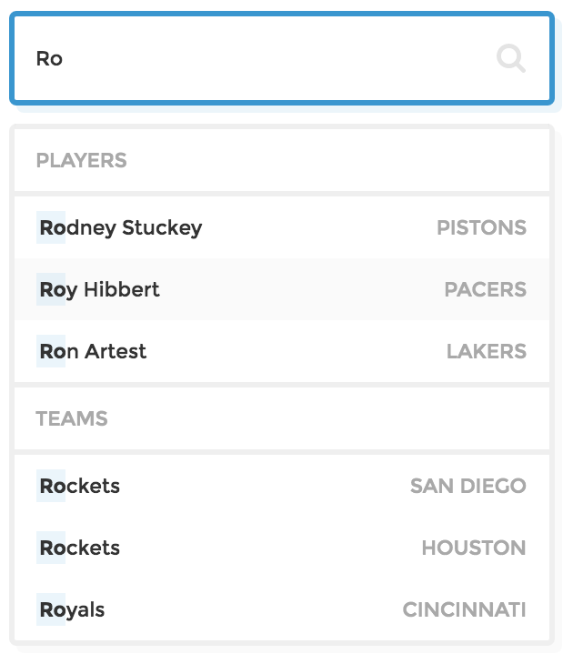
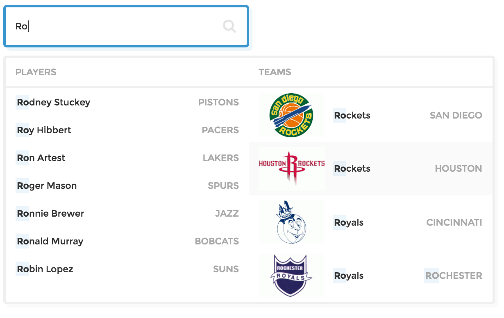

# Autocomplete Demos
Demos showing different possible implementations of an autocomplete menu using [autocomplete.js](https://github.com/algolia/autocomplete.js/), from a basic menu to a rich, horizontal experience. The full tutorial can be viewed in the [Algolia guides](https://www.algolia.com/doc/autocomplete).

##Demos
**Basic Autocomplete**

View the [live demo and tutorial](https://www.algolia.com/doc/autocomplete#try-it---live-demo) / Source code in the [basic-autocomplete](https://github.com/algolia/examples/tree/add_autocomplete_guide/autocomplete/demos/basic-autocomplete) folder

**Basic Autocomplete With "X"**

View the [live demo and tutorial](https://www.algolia.com/doc/autocomplete#try-it---live-demo-1) / Source code in the [basic-autocomplete-with-x folder](https://github.com/algolia/examples/tree/add_autocomplete_guide/autocomplete/demos/basic-autocomplete-with-x)

**Multi-Category Autocomplete Vertical**

View the [live demo and tutorial](https://www.algolia.com/doc/admin/autocomplete#try-it---live-demo-2) / Source code in the [multi-category-autocomplete-vertical folder](https://github.com/algolia/examples/tree/add_autocomplete_guide/autocomplete/demos/multi-category-autocomplete-vertical)

**Multi-Category Autocomplete Horizontal**

View the [live demo and tutorial](https://www.algolia.com/doc/admin/autocomplete#try-it---live-demo-2) / Source code in the [multi-category-autocomplete-horizontal folder](https://github.com/algolia/examples/tree/add_autocomplete_guide/autocomplete/demos/multi-category-autocomplete-horizontal)

