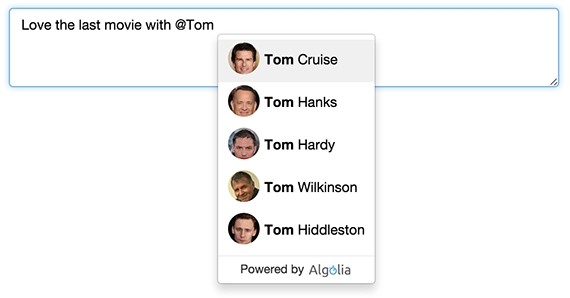
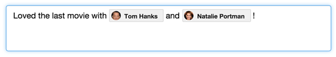

# Autocomplete in a Textarea
Demos showing how an autocomplete dropdown can be integrated within a textarea (or text input), and be easily leveraged to build:

* A @mention feature where users can easily do references to people (here we are mentionning @actors), places, resources, ...
* A #hashtag feature similar to what you can find on Twitter
* An *'Advanced search UI'*, with dynamic refinements: [see Abacus blogpost](https://blog.algolia.com/algolia-for-realtime-expense-reporting/)

Such kind of user experience are very handy on both Desktop and Mobile website.

## Demos
**Basic autocomplete**

Try out the [live demo](https://demo.algolia.com/examples/textarea-autocomplete/basic-autocomplete.html) / Source code in the [basic-autocomplete.html](basic-autocomplete.html) file

**Autocomplete with picture**

Try out the [live demo](https://demo.algolia.com/examples/textarea-autocomplete/autocomplete-with-pictures.html) / Source code in the [autocomplete-with-pictures.html](autocomplete-with-pictures.html) file

**Rich HTML textarea**

Try out the [live demo](https://demo.algolia.com/examples/textarea-autocomplete/rich-html-textarea.html) / Source code in the [rich-html-textarea.html](rich-html-textarea.html) file

**Autocomplete with picture & Rich HTML textarea**

Combination of all the previous versions.

Try out the [live demo](https://demo.algolia.com/examples/textarea-autocomplete/full-html-textarea-autocomplete.html) / Source code in the [full-html-textarea-autocomplete.html](full-html-textarea-autocomplete.html) file

## Data Set
List of the [500 popular actors](dataset/actors.json) extracted from themoviedb.org
